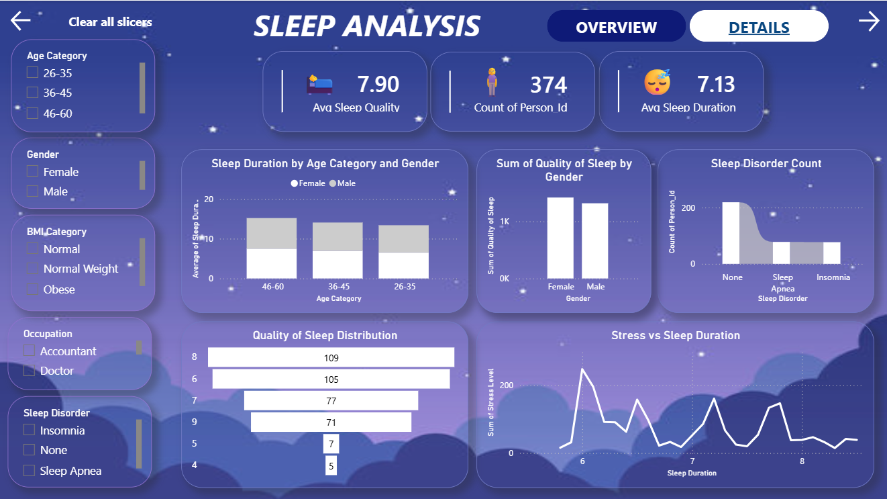
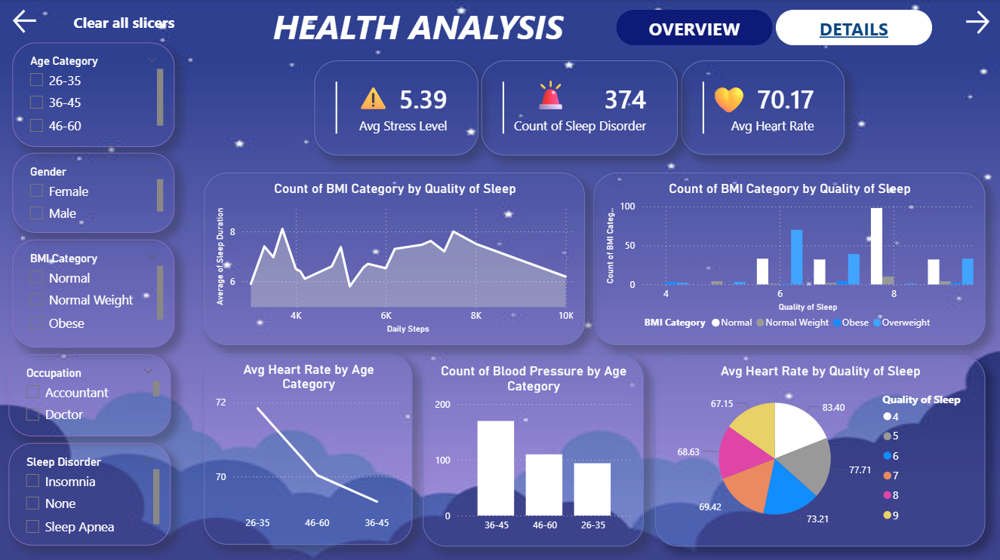
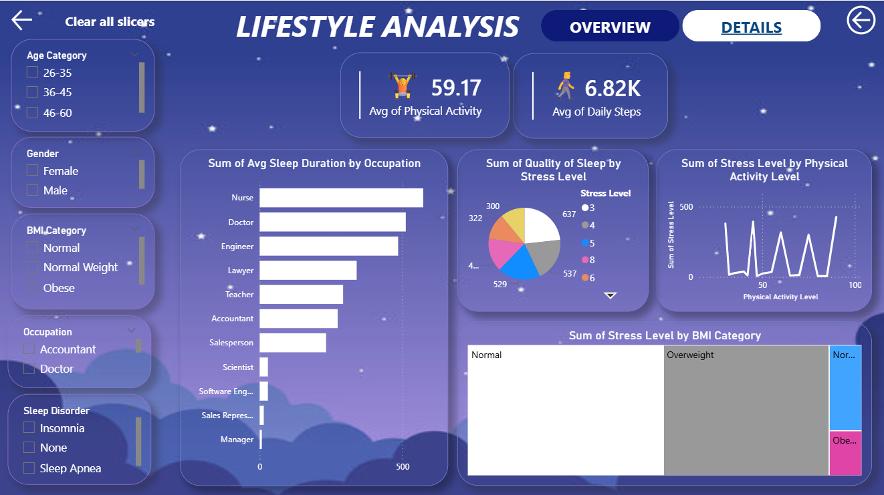

# Sleep-Tracker-Data-Analysis (POWER BI)

## 📊 Overview
 • Developed an interactive Power BI dashboard to analyse sleep, health, and lifestyle patterns  
 • Performed data cleaning and transformation using SQL and DAX Query  
 • Created visualizations for sleep quality, stress, heart rate, and activity analysis  
 • Generated actionable insights for data-driven health decisions

 ## 🚀 Key Features
- Sleep Quality & Duration Analysis
- Stress Level & Heart Rate Insights
- Lifestyle & Physical Activity Tracking
- Sleep Disorder Analysis (Insomnia, Sleep Apnea)

## 🛠 Tools Used
Power BI, DAX, SQL, Excel

## 📈 Insights
- Identified relationship between stress and sleep duration
- Analyzed impact of lifestyle and physical activity on sleep quality
- Evaluated health indicators like heart rate and BMI
- Provided data-driven insights for improving sleep patterns

## 📷 Dashboard Preview

## 📁 Files
- sleep tracker.pbix
- Sleep_dataset.xlsx
